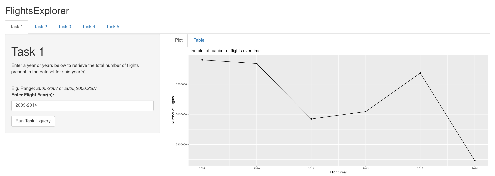
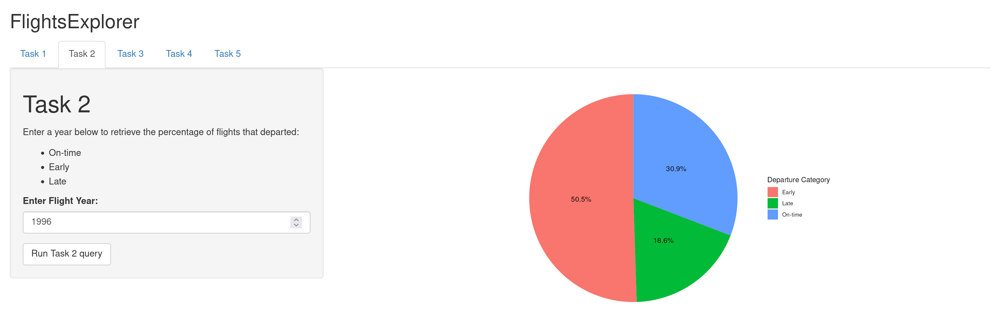
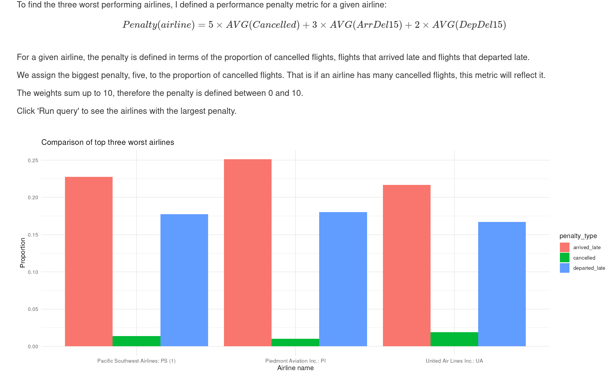

# FlightsExplorer

<small> \**Banner image generated using [Shakker](https://www.shakker.ai)*</small>

FlightsExplorer is a *work-in-progress*, interactive data mining tool for the [US Airline Reporting Carrier On-Time Performance dataset](https://www.transtats.bts.gov/DL_SelectFields.aspx?gnoyr_VQ=FGJ&QO_fu146_anzr=b0-gvzr).

FlightsExplorer follows a client-server architecture. The server is written in Python while the client is written in R.

The server queries the dataset using Apache Spark ([PySpark](https://spark.apache.org/docs/latest/api/python/index.html)) and serves the results in JSON at pre-defined HTTP endpoints.

A custom Flask module was developed for PySpark, present in *flask_flights_explorer/Flask_Spark.py*, to be able to re-use the same Spark Session for different queries; otherwise the Spark session is lost after a request is handled due to [Flask's ephemeral request context](https://flask.palletsprojects.com/en/3.0.x/reqcontext/) lifecycle.

The client, effectively an R web-app, sends asynchronous GET/POST requests to the server and displays the results neatly using the ggplot2 library and the [Shiny](https://shiny.posit.co/) framework.

# Features

1. Exploring the distribution of flights in a given time range :

2. Inspecting the performance of all airlines in a given year :

3. Finding the worst performing airlines using a custom weighted penalty :

and more!

# How to run

Downloading the flights dataset and supplementary csv files from the [US Transtats website](https://www.transtats.bts.gov/DL_SelectFields.aspx?gnoyr_VQ=FGJ&QO_fu146_anzr=b0-gvzr).

## Flask JSON API Server Setup

All steps assume you have a terminal open __inside the FlightsExplorer directory__.

Run the following to create and enter a new Python virtual environment:

`python3 -m venv .venv`
`source .venv/bin/activate`

Then, install the following packages in the environment:

`pip install pyspark==3.5.1 Flask==3.0.2`

The Flask API server expects to read the database and supplementary csvs in _parquet_ format from a data subdirectory inside its instance directory.

Therefore, to convert the CSV files to parquet and have the serve find the files, run the parquet_converter script as follows:

`python3 parquet_converter.py <path to downloaded csv files> instance/data`

This will automatically create a new instance/data directory inside FlightsExplorer.

Finally, to run the JSON api server:

``flask --app flask_flights_explorer run``

If everything goes correctly, the API server should be listening for requests on http://127.0.0.1:5000/
To check, go to http://127.0.0.1:5000/hello on a web browser and you should see "Hello, World!" printed out.

## Shiny App setup
For the shiny app to work, the Flask server must be up and running already on port 5000!

1. Open-up the *shiny_app* directory in RStudio.
2. Open-up server.R
3. A warning should appear asking you to install all the dependecies needed. If it does not, type the following in the Console:
`install.packages(c("shiny", "bslib", "promises", "future", "httr", "jsonlite", "tidyverse"))`
4. Click "Run App" on the top right corner of the edit panel.
5. A web browser window should be automatically launched with the Shiny app.

